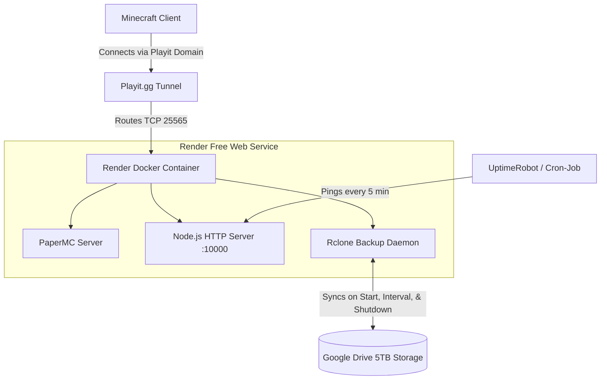

# 24/7 Cloud Minecraft Server (Render + Google Drive + Playit.gg)

A containerized, 24/7 Minecraft server solution utilizing **Render (Free Tier)** for computing, **Google Drive (5TB)** via Rclone for persistent world storage & backups, and **Playit.gg** for public TCP port forwarding.

---

## ⚡ How This Architecture Works



---

## 🛠️ Step-by-Step Setup Guide

### Step 1: Get a Free Playit.gg Account & Secret Key
1. Go to [playit.gg](https://playit.gg/) and create an account.
2. Under **Tunnels / Agents**, create a new agent or note your secret key (`PLAYIT_SECRET_KEY`).
3. Create a Minecraft Java tunnel (`TCP`) pointing to port `25565`. Playit will give you a public address like `custom-name.gl.joinmc.link`.

---

### Step 2: Configure Google Drive with Rclone (One-Time Setup)
To allow Render to automatically sync your world to your 5TB Google Drive:
1. Download [Rclone](https://rclone.org/downloads/) on your local PC.
2. Run `rclone config` in your terminal:
   - Choose `n` (New remote)
   - Name: `gdrive`
   - Storage Type: `drive` (Google Drive)
   - Follow prompts to authenticate with your Google account.
3. Once authenticated, view your config file location using `rclone config file` (usually located at `~/.config/rclone/rclone.conf` or `%APPDATA%\rclone\rclone.conf`).
4. Encode your `rclone.conf` content to Base64:
   - On Windows (PowerShell):
     ```powershell
     [Convert]::ToBase64String([IO.File]::ReadAllBytes("$env:APPDATA\rclone\rclone.conf"))
     ```
   - On Linux/macOS:
     ```bash
     base64 -w 0 ~/.config/rclone/rclone.conf
     ```
5. Copy the generated Base64 string.

---

### Step 3: Deploy to Render
1. Push this folder (`d:\minecraft server`) to your GitHub repository.
2. Go to [Render Dashboard](https://dashboard.render.com/) and click **New +** -> **Web Service**.
3. Connect your GitHub repository.
4. Select **Docker** environment and **Free** instance type.
5. In **Environment Variables**, configure:
   - `PORT`: `10000`
   - `RAM_MB`: `400M` (Free tier provides 512MB RAM total)
   - `GDRIVE_REMOTE_NAME`: `gdrive`
   - `RCLONE_CONFIG_BASE64`: *(Paste your Base64 string from Step 2)*
   - `PLAYIT_SECRET_KEY`: *(Paste your Playit secret key from Step 1)*
6. Click **Create Web Service**.

---

### Step 4: Keep It 24/7 Awake with UptimeRobot
Render free tier spins down after 15 minutes of HTTP inactivity.
1. Copy your Render web service URL (e.g., `https://minecraft-server-xxxx.onrender.com`).
2. Go to [UptimeRobot.com](https://uptimerobot.com/) (Free).
3. Create an **HTTP(s)** monitor pointing to your Render URL with a **5-minute interval**.
4. This ensures your server stays awake 24/7!

---

## ⚠️ Important Note regarding Aternos

- **Why Aternos can't be used for 24/7 hosting**:
  Aternos is designed strictly to shut down whenever no human players are active. Using external AFK bots or auto-restarters on Aternos violates their Terms of Service and triggers automated IP bans via Cloudflare protection.
- This **Render + Google Drive + Playit.gg** setup replaces Aternos, giving you full control over world saves, uptime, and plugins.
